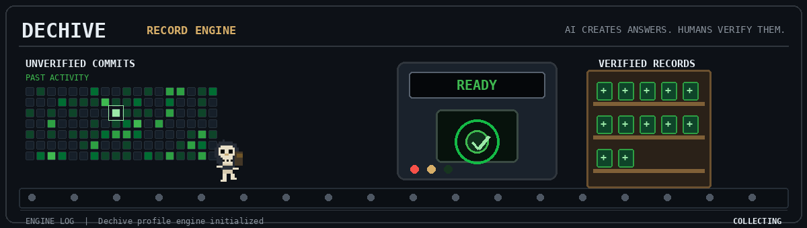

  

<h1 align="left">Demian</h1>

  Building systems for AI verification, knowledge records, and human judgment.

> **AI creates answers. Dechive verifies them.**

---

## Current systems

| System | Purpose | State |
|---|---|---|
| **Dechive** | A verification-first archive for questioning AI-generated answers | Building |
| **Akashic** | A personal AI concept for recording and interpreting a life | Planning |

## Current record

**Building Dechive as a living, verifiable knowledge system.**

Dechive begins with one question and preserves the reasoning, sources, boundaries, and human judgment behind the answer.

[Open Dechive](https://dechive.dev) ·
[Archive](https://dechive.dev/archive) ·
[English Archive](https://dechive.dev/en/archive) ·
[Downloads](https://dechive.dev/downloads)

## Selected records

- [Before Asking AI for Answers, Hand Over Your Thinking](https://dechive.dev/en/archive/handing-over-thought-first)
- [SQL NULL is not an empty value](https://dechive.dev/en/archive/what-null-leaves-behind)

## Working with

`TypeScript` · `Next.js` · `React` · `PostgreSQL` · `Supabase`

## Connect

[Dechive](https://dechive.dev) ·
[Instagram](https://instagram.com/dechiveyoon) ·
[Email](mailto:heavenis0113@gmail.com)
