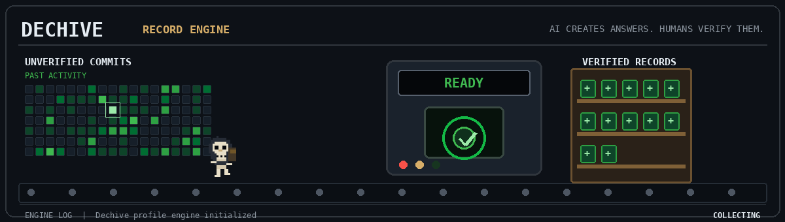

  

<h1 align="left">Demian · 윤강혁</h1>

  AI 활용 교육, 서비스 기획, 웹·자동화 프로젝트를 직접 만들고 검증합니다.

> **AI creates answers. Humans verify them.**

[Studio](https://studio.dechive.dev) ·
[Resume](https://studio.dechive.dev/resume) ·
[Dechive](https://dechive.dev)

---

## Selected Projects

### 01 · 군산시탁구협회 디지털 행정 시스템

반복되는 회원등록·이적·승인·문서 취합 업무를 하나의 디지털 행정 흐름으로 재설계한 프로젝트입니다.

- 기존 회원등록 흐름을 6단계로 분해
- 회원등록 / 이적 승인 / 문서 생성 / 외부 대회정보 확인을 MVP 핵심 범위로 설정
- Excel/HWP 최종 제출 형식은 유지하면서 중간 전달·재입력·취합을 줄이는 방향으로 설계
- Next.js · TypeScript · Supabase · ExcelJS · js-hwp

[Repository](https://github.com/Aprasaks/gunsan-table-tennis-association) ·
[Case Study](https://studio.dechive.dev/work/association-system/) ·
[Live](https://gunsan-table-tennis-association.vercel.app)

---

### 02 · 군산.com

군산의 장소를 더 많이 보여주는 포털이 아니라, 처음 온 사람이 그대로 따라갈 수 있는 여행 코스와 선택지를 정리하는 지역 여행 큐레이션 프로젝트입니다.

- 코스 중심 제품으로 방향 전환
- 7개 코스 테마
- 코스당 3~5개 핵심 정류장 기준
- 9단계 콘텐츠 제작·검증 프로세스
- 5단계 정보 검증 상태 설계

[Repository](https://github.com/Aprasaks/gunsan-com) ·
[Live](https://gunsan-com.vercel.app)

---

### 03 · DECHIVE

누구나 AI를 쉽게 이해하고 직접 사용해본 뒤, 그 결과를 스스로 검증하고 다시 꺼내 쓸 수 있는 지식으로 남기도록 돕는 AI 학습·검증 플랫폼입니다.

- CREATE · VERIFY · ARCHIVE
- Knowledge / Lecture / AI Update / Practice / Books 5개 영역
- 쉽게 이해 → 직접 해보기 → 다시 설명 → 함께 축적하는 4단계 학습 흐름
- Next.js · TypeScript · Sanity · Tailwind CSS

[Repository](https://github.com/Aprasaks/dechive-site) ·
[Live](https://dechive.dev)

---

### 04 · Dechive Stock Scalping Lab

AI에게 실제 돈을 맡기기 전에 국내주식 단기 판단이 데이터와 로그로 반복 검증 가능한지 확인하는 실험 프로젝트입니다.

- KIS read-only 시장 데이터
- Paper Trading / Decision Journal / Risk Harness
- 판단 이후 가격 결과 추적
- live trial: watch run 30회 · price snapshot 150건 · watch event 150건 · error 0회
- **실제 주문 0건**

Private repository · Paper / verification only

---

## What I Work On

- AI 활용 교육과 실습 구조
- 서비스 기획과 MVP 범위 정의
- 업무 흐름 분석과 자동화
- 웹 서비스와 데이터 구조
- AI 결과 검증과 안전장치 설계

## Stack

`TypeScript` · `Next.js` · `React` · `Python` · `PostgreSQL` · `Supabase` · `Sanity` · `Playwright`

## Connect

[Studio](https://studio.dechive.dev) ·
[Resume](https://studio.dechive.dev/resume) ·
[Dechive](https://dechive.dev) ·
[Email](mailto:heavenis0113@gmail.com)
